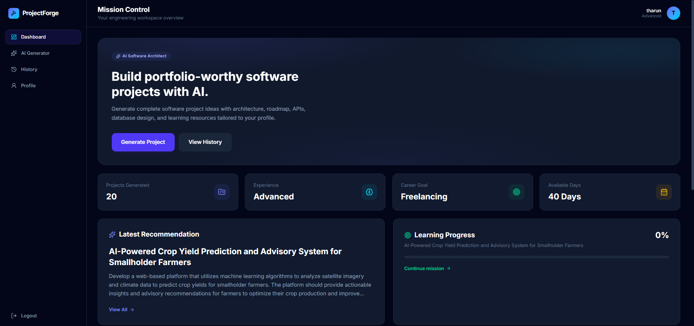
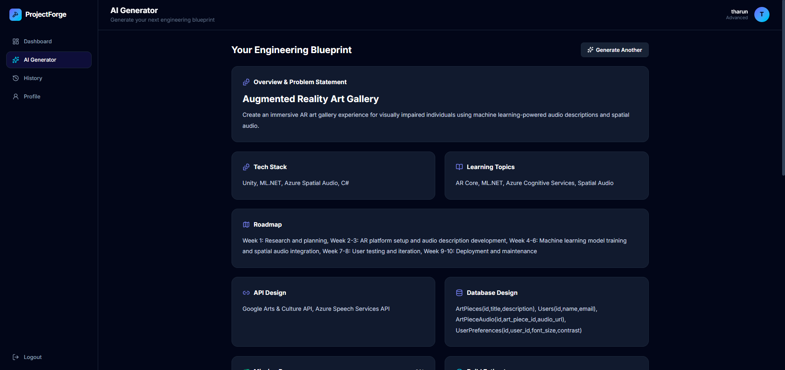
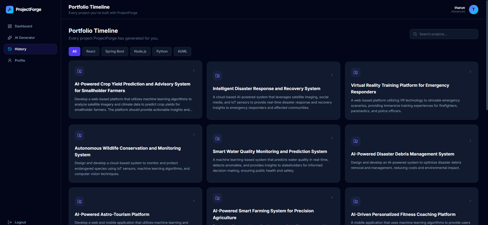
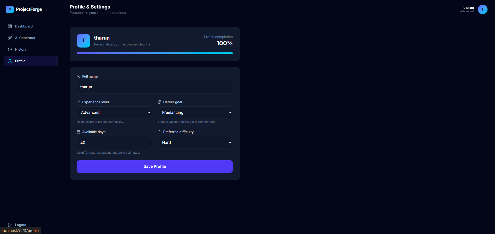

# ProjectForge AI

> An AI-powered software engineering workspace that transforms a developer's skills, experience, and career goals into personalized project blueprints and guides them from idea to interview.

## Overview

ProjectForge AI is a full-stack application designed to solve a common problem faced by students, freshers, and aspiring software engineers:

**"What project should I build next, and how do I actually build it?"**

Instead of generating random project ideas, ProjectForge AI analyzes the user's profile and generates a personalized engineering blueprint containing architecture guidance, technology recommendations, learning topics, development roadmaps, API designs, database structures, build estimates, resume assistance, interview preparation, and project progress tracking.

The platform turns project discovery into a complete engineering journey:

**Idea → Blueprint → Build → Resume → Interview**

## Screenshots

### Landing Page


### Engineering Dashboard



### AI Engineering Blueprint



### Project History



### Developer Profile



## Key Features

- **Personalized AI Project Recommendations** — Generates project ideas based on the user's experience level, career goals, available time, and preferred difficulty.

- **Complete Engineering Blueprints** — Provides project descriptions, technology stacks, learning topics, development roadmaps, API designs, and database structures.

- **Mission Progress Tracking** — Converts generated projects into actionable engineering missions with persistent progress tracking.

- **Build Estimation** — Estimates project complexity and development effort based on the generated blueprint and developer profile.

- **Resume Assistant** — Helps developers convert their projects into resume-ready content.

- **Interview Preparation** — Generates project-specific preparation material to help users explain their engineering decisions during interviews.

- **AI Mentor Workspace** — Provides contextual engineering guidance throughout the development journey.

- **Recommendation History** — Stores previously generated projects so users can revisit their engineering blueprints.

- **Developer Dashboard** — Displays profile insights, recommendation statistics, recent activity, learning progress, and quick actions.

- **Secure Authentication** — JWT-based authentication and protected frontend routes.

- **Developer Profile Management** — Allows users to configure career goals, experience level, preferred difficulty, and available development time.

## System Architecture

```text
                         ┌───────────────────────┐
                         │        USER           │
                         └───────────┬───────────┘
                                     │
                                     ▼
                         ┌───────────────────────┐
                         │   React + Vite UI     │
                         │                       │
                         │  Dashboard            │
                         │  AI Recommendations   │
                         │  Project History      │
                         │  Developer Profile    │
                         └───────────┬───────────┘
                                     │
                                     │ REST API
                                     ▼
                         ┌───────────────────────┐
                         │   Spring Boot API     │
                         │                       │
                         │  Authentication       │
                         │  User Management      │
                         │  Recommendation Logic │
                         │  AI Integration       │
                         └──────┬─────────┬──────┘
                                │         │
                                │         │
                                ▼         ▼
                    ┌───────────────┐  ┌───────────────┐
                    │     MySQL     │  │   Groq API    │
                    │               │  │               │
                    │ Users         │  │ AI Blueprint  │
                    │ Recommendations│ │ Generation    │
                    └───────────────┘  └───────────────┘
```

## Tech Stack

### Frontend

- React
- Vite
- Tailwind CSS
- Framer Motion
- Axios
- React Router
- Lucide React
- React Hot Toast

### Backend

- Java
- Spring Boot
- Spring Security
- Spring Data JPA
- JWT Authentication
- Maven
- REST APIs

### Database

- MySQL

### AI Integration

- Groq API

### Development Tools

- Git
- GitHub
- IntelliJ IDEA
- Visual Studio Code
- Postman

## Project Structure

```text
ProjectForge/
│
├── backend/
│   ├── src/main/java/com/projectforge/
│   │   ├── config/
│   │   ├── controller/
│   │   ├── dto/
│   │   ├── entity/
│   │   ├── exception/
│   │   ├── repository/
│   │   ├── security/
│   │   └── service/
│   │
│   └── src/main/resources/
│       └── application.properties
│
├── frontend/
│   ├── public/
│   └── src/
│       ├── components/
│       ├── context/
│       ├── pages/
│       ├── routes/
│       ├── services/
│       └── utils/
│
├── screenshots/
├── .gitignore
└── README.md
```

## How It Works

1. A user creates an account and securely logs into ProjectForge AI.
2. The user configures their developer profile, experience, goals, available time, and preferred difficulty.
3. The frontend sends an authenticated recommendation request to the Spring Boot backend.
4. The backend builds a personalized AI prompt based on the user's profile.
5. The AI service generates a structured software engineering project blueprint.
6. The generated recommendation is processed and stored in MySQL.
7. The user receives a complete workspace containing architecture guidance, technology recommendations, a roadmap, API design, database design, mission tracking, build estimation, resume assistance, and interview preparation.

## Getting Started

### Prerequisites

Ensure the following tools are installed:

- Java
- Maven or Maven Wrapper
- Node.js and npm
- MySQL
- Git

## Clone the Repository

```bash
git clone https://github.com/tharun17-web/projectforge-ai.git
cd projectforge-ai
```

## Database Setup

Create a MySQL database:

```sql
CREATE DATABASE projectforge;
```

## Environment Variables

ProjectForge AI uses environment variables to protect sensitive credentials.

Configure the following variables in your local development environment:

```text
DB_PASSWORD=your_mysql_password
GROQ_API_KEY=your_groq_api_key
JWT_SECRET=your_secure_jwt_secret
```

The backend references these variables through `application.properties`:

```properties
spring.datasource.password=${DB_PASSWORD}
groq.api.key=${GROQ_API_KEY}
jwt.secret=${JWT_SECRET}
```

> Never commit API keys, database passwords, JWT secrets, or other credentials to source control.

## Running the Backend

Navigate to the backend directory:

```bash
cd backend
```

On Windows:

```bash
mvnw.cmd spring-boot:run
```

Alternatively, run `BackendApplication` directly from IntelliJ IDEA.

The backend runs on:

```text
http://localhost:8080
```

## Running the Frontend

Open another terminal:

```bash
cd frontend
npm install
npm run dev
```

The frontend runs on:

```text
http://localhost:5173
```

## Core Backend Modules

### Authentication

Handles user registration, login, password security, JWT generation, and authenticated requests.

### User Profile

Manages developer information used to personalize AI recommendations.

### Recommendation Engine

Generates and stores AI-powered software engineering project recommendations.

### Prompt Builder

Transforms developer profile information into structured prompts for personalized project generation.

### AI Integration

Communicates with the AI service and processes generated engineering blueprints.

### Security

Uses Spring Security and JWT authentication to protect application endpoints.

## Future Improvements

- Cloud deployment for frontend, backend, and database
- Docker-based development and deployment
- Automated testing and CI/CD pipeline
- Email verification and password recovery
- GitHub repository analysis
- Resume document upload and analysis
- Enhanced AI mentor conversations
- Project collaboration features
- Cloud-based mission progress persistence
- Production-grade monitoring and logging

## Why ProjectForge AI?

Many project generators stop after suggesting an idea.

ProjectForge AI is designed around the complete software engineering journey.

It helps developers:

- discover what to build,
- understand why the project matters,
- plan the system architecture,
- choose an appropriate technology stack,
- design APIs and databases,
- track implementation progress,
- convert completed work into resume content,
- and prepare to discuss engineering decisions during interviews.

The goal is not simply to generate another project.

**The goal is to help developers build the right project and understand how to engineer it.**

## Author

**Tharun**

GitHub: `tharun17-web`

---

If you found ProjectForge AI interesting, consider starring the repository.

**Build the right project, not just another project.**